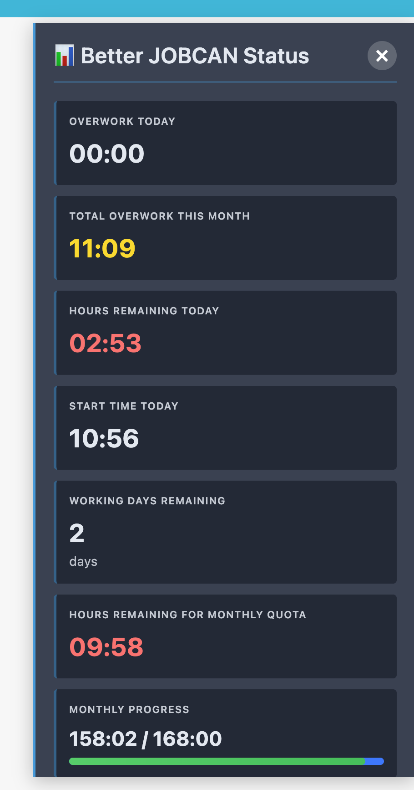

[English](README.md) | [日本語](README.ja.md)

# Better JOBCAN - 勤怠管理ヘルパー拡張版

JOBCANの勤怠管理を強化するブラウザ拡張機能です。残業時間、本日の残り時間、出勤時間、残り勤務日数、月間クォータの進捗など、便利な勤務指標を表示します。



> **⚠️ ステータス**: このプロジェクトはまだ開発中です。機能が変更される可能性があり、バグが存在する場合があります。
> **注意**: このプロジェクトは exoego 氏の [jobkan-helper](https://github.com/exoego/jobkan-helper) にインスパイアされています。

## 機能

- 📊 **残業時間**: シフト外の労働時間を表示
- ⏰ **本日の残り時間**: シフトに基づいて今日必要な残り労働時間を計算
- 🕐 **本日の出勤時間**: 今日の出勤打刻時間を表示
- 📅 **残り勤務日数**: 今月の残り勤務日数をカウント
- 🎯 **月間クォータ進捗**: 月間所定労働時間に対する進捗を表示
- 💡 **リアルタイム更新**: 毎分自動的に更新
- 🌐 **言語切り替え**: 英語と日本語のインターフェース切り替え

## インストール

### ステップ1: 拡張機能のビルド

1. このリポジトリをクローン:

```bash
git clone <repository-url>
cd better-jobcan
```

2. 依存関係をインストール:

```bash
npm install
```

3. 拡張機能をビルド:

```bash
npm run build
```

ビルドされた拡張機能は `dist` フォルダに生成されます。

### ステップ2: ブラウザにロード

1. `chrome://extensions/`（または `edge://extensions/`）を開く
2. **「デベロッパーモード」** を有効にする（右上のトグル）
3. **「パッケージ化されていない拡張機能を読み込む」** をクリック
4. このプロジェクトの `dist` フォルダを選択

## アップデート

GitHubから最新の変更をプルした後:

1. 最新の変更をプル:

```bash
git pull
```

2. 拡張機能を再ビルド:

```bash
npm run build
```

3. `chrome://extensions/`（または `edge://extensions/`）にアクセス
4. Better JOBCAN拡張機能を見つけて、アイコンの近くにある**リロードボタン**（↻）をクリック


## 使い方

1. `https://ssl.jobcan.jp/employee/attendance` にアクセス
2. 拡張機能がページの**右側**に指標パネルを自動的に表示します
3. パネルには以下が表示されます:
   - **本日の残業**: 今日の残業時間（白色で表示）
   - **今月の残業合計**: 累積残業時間（プラスの場合は黄色で表示）
   - **本日の残り時間**: シフト完了までに必要な時間（残りがある場合は赤、完了の場合は緑で表示）
   - **本日の出勤時間**: 今日の出勤打刻時間
   - **残り勤務日数**: 今月の残り勤務日数
   - **月間クォータ残り時間**: 月間クォータ達成までに必要な時間（残りがある場合は赤で表示）
   - **月間進捗**: 現在の月間合計 vs 月間クォータを視覚的なプログレスバーで表示（例: "158:02 / 168:00"）

4. **言語切り替え**: パネルヘッダーの言語セレクターを使用して、英語と日本語のインターフェースを切り替えられます

**注意**: この拡張機能は `https://ssl.jobcan.jp/employee/attendance` でのみ動作します。パネルはページにいる間、毎分自動的に更新されます。パネルを閉じるには右上の × ボタンをクリックしてください。

## コントリビューション

このプロジェクトに貢献したい場合:

1. リポジトリをフォーク
2. 依存関係をインストール: `npm install`
3. `src/` ディレクトリで変更を加える
4. 自動リロード付き開発:

   ```bash
   npm run dev
   ```

   ウォッチモードでビルドされます - 変更後にJOBCANページをリロードしてください。

5. 型チェック:

   ```bash
   npm run type-check
   ```

6. プロダクションビルド:

   ```bash
   npm run build
   ```

7. プルリクエストを提出

### プロジェクト構造

```text
├── src/
│   ├── content.ts          # メインコンテンツスクリプト
│   ├── data-extractor.ts   # JOBCANページからデータを抽出
│   ├── utils.ts            # 計算ユーティリティ
│   ├── ui.ts               # UIオーバーレイコンポーネント
│   ├── types.ts            # TypeScript型定義
│   └── styles.css          # オーバーレイのスタイル
├── dist/                   # ビルドされた拡張機能（生成）
├── manifest.json           # 拡張機能マニフェスト
├── webpack.config.js       # Webpack設定
├── tsconfig.json           # TypeScript設定
└── package.json           # 依存関係
```

## ライセンス

MIT
